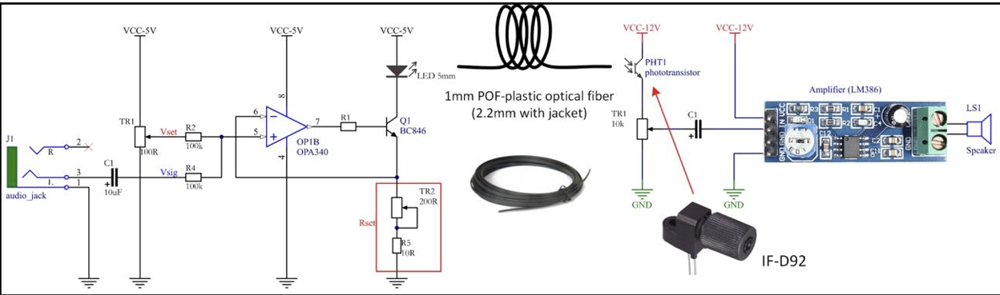

# optical-communication-audio-transmission
Designed and built an optical communication system to transmit audio signals over plastic optical fiber using LED modulation and phototransistor detection.

# Optical Communication Audio Transmission System

## Overview

This project involves designing and building an optical communication system that transmits audio signals over a plastic optical fiber (POF) link.

The system demonstrates key concepts of optical communication, including signal modulation, light transmission through fiber, and signal recovery at the receiver.

## Objective

* Transmit analog audio signals using optical fiber
* Implement LED-based light modulation
* Recover transmitted signal using a phototransistor
* Amplify and play audio output through a speaker

## System Architecture

### Transmitter

* Audio input from a 3.5 mm jack
* Signal conditioning using capacitor (DC blocking)
* Amplification using OPA340 op-amp
* LED driven by transistor (BC846) for optical modulation

### Optical Link

* 1 mm Plastic Optical Fiber (POF)
* Transmits modulated light signal

### Receiver

* Phototransistor (IF-D92) detects light signal
* Signal converted back to electrical form
* LM386 amplifier used to drive speaker output

## Working Principle

* Audio signal modulates LED intensity
* Light travels through optical fiber
* Phototransistor converts light back to electrical signal
* Amplifier reconstructs audio signal for output

## Key Design Concepts

### Signal Conditioning

* Capacitor used to block DC offset and pass AC signal
* Resistors used for biasing and gain control

### LED Modulation

* LED brightness varies with audio signal
* Transistor used to amplify current for LED driving

### Signal Recovery

* Phototransistor detects light intensity variations
* Capacitor removes DC components before amplification

## Engineering Insights

* Gain control affects signal strength and distortion
* LED current regulation is critical for signal quality
* Fiber losses occur due to bending, scattering, and misalignment
* Phototransistor response time impacts audio quality

## Skills Demonstrated

* Optical communication system design
* Analog circuit design
* Signal modulation and detection
* Amplifier design
* Hardware integration and testing
* Troubleshooting signal distortion and noise

## Tools & Components

* OPA340 Op-Amp
* BC846 Transistor
* LED (Optical source)
* Phototransistor (IF-D92)
* LM386 Audio Amplifier
* Plastic Optical Fiber (POF)
* Breadboard and power supply

## System Diagram

